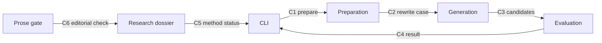

# ARCHITECTURE: Claude Watermark Toolkit

Living reference. Read before each build stage and update when a contract changes.

Origin: `_context/product-spec-2026-08-28.md` and `_context/product-interrogation-2026-08-28.md`.
Status: ACTIVE. Features approved by Danilo on 2026-08-28.

## 1. Organs and single responsibilities

| Organ | One responsibility | Location | Exposes | Does not do |
|---|---|---|---|---|
| Rewrite case | Define the immutable data exchanged by the pipeline | `src/contracts.js` | Case constructors and validation | Generate prose |
| Invariant extractor | Find facts and spans that must survive | `src/invariants.js` | Protected span list | Decide writing style |
| Reconstruction brief | Convert source material into a wording-independent brief | `src/reconstruction.js` | Brief builder and prompt | Call a provider |
| Provider boundary | Send an approved request to a non-Anthropic endpoint | `src/providers.js` | Ollama and OpenAI-compatible adapters | Score candidates |
| Target selector | Identify passages with high rewrite value | `src/targeting.js` | Ranked rewrite targets | Claim detector knowledge |
| Candidate generator | Produce independent drafts through a provider | `src/generation.js` | Candidate list | Select the winner |
| Validator | Check invariants, overlap and readability | `src/validators.js` | Candidate scorecards | Make external calls |
| Selector | Rank valid candidates across several objectives | `src/selection.js` | Pareto set and recommended candidate | Hide trade-offs |
| CLI | Turn user commands into pipeline calls | `bin/claude-watermark-toolkit.js` | Human and JSON output | Own business logic |
| Prose gate | Enforce the public writing rules | `scripts/check-prose.mjs` | Pass or precise failures | Judge factual truth |
| Research dossier | Own evidence, uncertainty and experiment protocol | `research/`, `CLAIMS.md` | Claim ladder and methods | Pretend to be a detector |

## 2. Systems

| System | Organs | Responsibility | Input | Output |
|---|---|---|---|---|
| Preparation | Rewrite case, invariant extractor, reconstruction brief | Prepare a safe, wording-independent drafting task | Source text and language | Protected rewrite case |
| Generation | Provider boundary, target selector, candidate generator | Produce candidate drafts without Anthropic | Protected rewrite case and method | Candidate drafts |
| Evaluation | Validator, selector | Reject broken candidates and explain the remaining trade-offs | Case and candidates | Scorecards and recommendation |
| Interface | CLI | Make the systems usable from a terminal or another agent | Command and files | Plain text or JSON |
| Knowledge | Prose gate, research dossier | Keep public writing and claims honest | Docs, sources and tests | Gate result and evidence record |

## 3. Interaction map

## 4. Data flow

The source enters from a file or standard input. Preparation detects protected facts and creates a rewrite case. Semantic reconstitution turns the source into claims, constraints and voice notes before drafting. The generation system either exports a prompt or calls an approved non-Anthropic provider. Evaluation first rejects candidates that lose protected information. It then measures phrase and n-gram survival, readability and edit distance, and returns the non-dominated candidates plus a plain-language recommendation. The original source remains unchanged.

## 5. SSOT registry

| Data | Authoritative home | Derived copies | Never authoritative in |
|---|---|---|---|
| Pipeline shape | `src/contracts.js` | CLI JSON output | Docs examples |
| Provider policy | `src/providers.js` | Setup guides | Environment files |
| Method implementation state | `STATUS.md` | README tables | Website copy |
| Research claim state | `CLAIMS.md` | Guide summaries | Social posts |
| Public roadmap and receipts | `EXECUTION-PLAN.md` | README progress link | Private notes |
| Public prose rules | `scripts/check-prose.mjs` | Contributing guide | Reviewer memory |

## 6. Boundary contracts

| Boundary | Input | Output | Errors | Invariants | Version |
|---|---|---|---|---|---|
| C1 CLI to Preparation | file path, language, options | valid rewrite case | input, encoding, size | source immutable | v1 |
| C2 Preparation to Generation | rewrite case | prompt or request | missing brief, blocked provider | protected spans attached | v1 |
| C3 Generation to Evaluation | candidate strings | candidate list | timeout, empty response | source not overwritten | v1 |
| C4 Evaluation to CLI | scorecards and Pareto set | human or JSON report | no valid candidate | failures remain visible | v1 |
| C5 Knowledge to CLI | method identifier | state and limits | unknown method | research-only is labeled | v1 |
| C6 Prose gate to Knowledge | public files | pass or findings | unreadable file | no em dash, no banned stock phrases | v1 |

Contract changes require a version bump, a documented delta here, updates to every listed consumer and a contract test. No silent contract changes.

## 6-bis. Build versus adopt

Engine question: provider transport and text utilities are commodity and use the Node standard library. The project edge is reconstruction, protected-fact validation, target selection, multi-objective comparison and unusually clear public explanation.

| Organ | Verdict | Source, license or cost | Reason |
|---|---|---|---|
| Runtime and CLI | build | Node.js standard library | A small zero-dependency surface is easier to audit and install |
| Public SynthID surrogate | adopt as optional research reference | `google-deepmind/synthid-text`, Apache-2.0 | Official public implementation, unsuitable as a Claude detector claim |
| Attack patterns | extract pattern | SIRA and TSAPA papers | Research informs clean-room methods without importing unlicensed code |
| Rewrite engine | build | project code, MIT | This is the product edge and needs the project's contracts |
| Provider adapters | build | native `fetch` | Two small adapters avoid a large SDK and keep Anthropic out |
| Website rendering | adopt existing | `danilolapegna-new` guide registry | The site already owns bilingual guides, SEO and schema |

License pressure: the only optional code reference is Apache-2.0 with a clear exit path. Research repositories without a license are not copied. Runtime maintenance is limited to current Node LTS behavior and endpoint contract tests.

## 7. Incremental build order

1. Contracts, invariant extraction and tests. Coherent state: source can be prepared and checked offline.
2. Reconstruction brief and prompt export. Coherent state: a beginner can complete the manual workflow.
3. Provider boundary and mock end-to-end test. Coherent state: local and compatible endpoints can generate a candidate.
4. Validators and candidate selection. Coherent state: weak candidates are rejected with reasons.
5. Targeted and adaptive methods. Coherent state: advanced workflows run under explicit budgets.
6. Bilingual documentation, manifesto, skill and research dossier. Coherent state: every audience has a usable entry.
7. Website guides, profile links and public verification. Coherent state: discovery paths work in both directions.

## 8. Health and self-repair

| Health organ | Function | Owner |
|---|---|---|
| Contract tests | Exercise every boundary above | Node test suite |
| Prose gate | Blocks banned public-writing patterns | `scripts/check-prose.mjs` |
| CI | Runs tests and public-file checks | GitHub Actions |
| Link and source check | Detects dead public claims and guide links | release checklist |
| Claim review | Reclassifies facts when evidence changes | `CLAIMS.md` maintainers |

## 9. Deterministic self-check

- PASS: each key datum has one authoritative home.
- PASS: every organ has one responsibility.
- PASS: every arrow in the interaction map has a contract.
- PASS: each organ belongs to a system and is reached by the data flow.
- PASS: each approved feature appears in the incremental build order.
