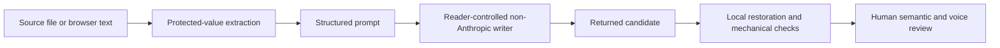

# Architecture

Living reference for the current public product. A removed experiment does not remain here as an active organ.

## Product boundary

The repository prepares structured prompts and evaluates returned drafts. It does not call a writing model, upload text, choose a final draft or reproduce Anthropic's detector.

## Components

| Component | One job | Location | Does not do |
|---|---|---|---|
| Rewrite case | Define the immutable source record | `src/contracts.js` | generate prose |
| Invariant extractor | Find exact values and user-supplied phrases | `src/invariants.js` | infer every important idea |
| Prompt builder | Build the primary and source-separated prompts | `src/reconstruction.js` | call a model |
| Validator | Measure exact-value retention, surface overlap, openings, length and readability drift | `src/validators.js` | approve meaning |
| Selector | Keep mechanically sound trade-offs visible | `src/selection.js` | recommend a winner |
| CLI | Connect local files to preparation and evaluation | `bin/watermark-toolkit.js` | make network requests |
| Browser core | Prepare prompts, restore values and compare drafts in the current tab | `docs/core.js` | render the page or persist text |
| Browser UI | Guide a non-technical reader through the workflow | `docs/index.html`, `docs/app.js`, `docs/styles.css` | upload or generate text |
| Public gates | Check prose, links, tests and static privacy contracts | `scripts/`, `test/` | certify detector success |
| Research dossier | Separate official facts, inferences, unknowns and experiments | `research/`, `CLAIMS.md` | market a hypothesis as a result |

## Data flow

The external writing step is intentionally outside the runtime. Rewrite Room and the CLI prepare the prompt. The reader chooses where to run it and brings the result back. The toolkit restores recognized `[PV-XX]` values locally, reports bounded surface evidence and leaves semantic approval to a person.

## Contracts

| Boundary | Input | Output | Fails when | Permanent limit |
|---|---|---|---|---|
| Preparation | non-empty source, language, optional protected values | immutable rewrite case | input is empty or language unsupported | automatic extraction misses some meaningful phrases |
| Prompt export | valid rewrite case | structured prompt or two-step clean-room pair | case is malformed | an external model can ignore instructions |
| Candidate check | source and exactly one candidate | restored draft and mechanical report | file missing, empty or output would overwrite an input | cannot verify semantic fidelity |
| Candidate comparison | source and at least two candidates | equal scorecards and mechanical shortlist | fewer than two candidates | cannot choose the author's voice |
| Browser workflow | source and returned candidate | prompt, restored draft and local comparison | required field empty or clipboard denied | no detector access |
| Public claim | cited evidence and status | fact, inference or unknown | support is missing or stale | private configuration remains unknown |

## Source separation

The primary prompt sees a locally masked source because it is the simplest serious route and has a real paired benchmark. The advanced route has two contexts: a research context sees the source and produces a checked brief; a genuinely separate writing context receives only that brief. Two messages in one conversation do not satisfy this contract.

## Why there is no automatic writer

Provider adapters and a candidate batch were implemented and tested with a local gpt-oss 20B model. The trials exposed research-prompt constraints inside the brief, JSON returned instead of prose, close copying and a false `BRIEF_ERROR` on a valid reviewed brief. The extra setup did not beat the admitted primary route reliably, so the runtime model calls were removed.

## Single sources of truth

| Subject | Authoritative file |
|---|---|
| Component and boundary contracts | `ARCHITECTURE.md` |
| Current implementation state | `STATUS.md` |
| Research claims | `CLAIMS.md` |
| Public execution and release sequence | `EXECUTION-PLAN.md` |
| Tool admission decisions | `REDTEAM.md` |
| Public writing rules | `scripts/check-prose.mjs` |

Contract changes require tests, updated consumer documentation and an explicit red-team verdict. A feature removed for product-quality reasons cannot return under a new label without new evidence.
